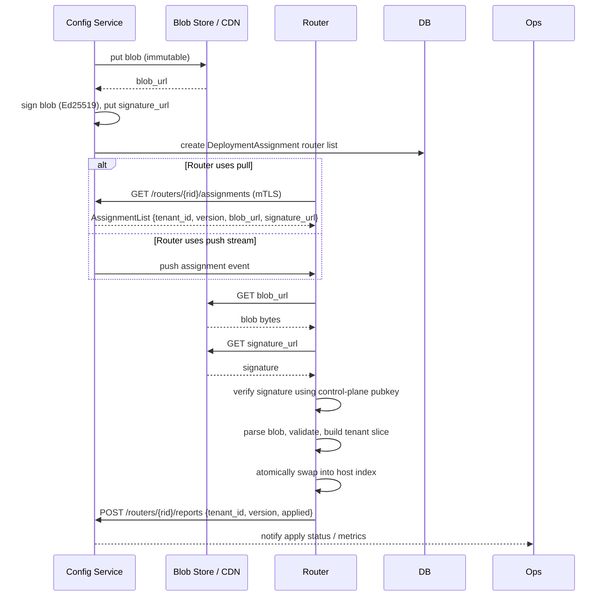

# Config Service ↔ Router API

This document describes the operational contract between the Config Service (control plane) and routers. It focuses only on the router-facing API: how routers pull assignments, fetch immutable blobs and signatures, verify signatures, and report apply results.

## Goals
- Describe how the Config Service signs immutable bundles and advertises them to routers.
- Describe router pull/poll and report endpoints and required verification (mTLS for routers + Ed25519 signatures for blobs).

## OpenAPI (compact YAML snippet)

```yaml
openapi: 3.0.1
info:
  title: CloudinatorMC Config Service API (compact)
  version: 1.0.0
servers:
  - url: https://controlplane.example.internal
paths:
  /configs/{router_id}/assignments:
    get:
      summary: Router pulls assignment manifest (mTLS client auth)
      parameters:
        - name: router_id
          in: path
          required: true
          schema:
            type: string
        - name: since
          in: query
          description: return only changes since this monotonic index
          schema:
            type: integer
      responses:
        '200':
          description: current assignments
          content:
            application/json:
              schema:
                $ref: '#/components/schemas/AssignmentList'

  /configs/{router_id}/reports:
    post:
      summary: Router reports apply results
      parameters:
        - name: router_id
          in: path
          required: true
          schema:
            type: string
      requestBody:
        required: true
        content:
          application/json:
            schema:
              $ref: '#/components/schemas/RouterReport'
      responses:
        '202':
          description: accepted

components:
  securitySchemes:
    # Note: routers authenticate with mTLS (operation environment), not by bearer tokens.

  schemas:
    AssignmentList:
      type: object
      properties:
        assignments:
          type: array
          items:
            $ref: '#/components/schemas/Assignment'
    Assignment:
      type: object
      required: [tenant_id, version, blob_url, signature_url]
      properties:
        tenant_id:
          type: string
        version:
          type: integer
        checksum:
          type: string
        blob_url:
          type: string
        signature_url:
          type: string
        effective_at:
          type: string
          format: date-time
    RouterReport:
      type: object
      required: [tenant_id, version, status]
      properties:
        tenant_id:
          type: string
        version:
          type: integer
        status:
          type: string
          enum: [applied, failed]
        message:
          type: string
        applied_at:
          type: string
          format: date-time
```

## Security and operational notes
- The Config Service signs every immutable bundle (Ed25519). Routers must verify signatures with the Config Service public key; routers must not accept unsigned blobs.
- Routers authenticate to the Config Service using mTLS client certificates; the Config Service verifies router identity and then returns only assignments the router should host.
- Tenant submission, hostname claim, and dashboard flows are intentionally out of scope for this document.

## Sequence diagram (Mermaid)


