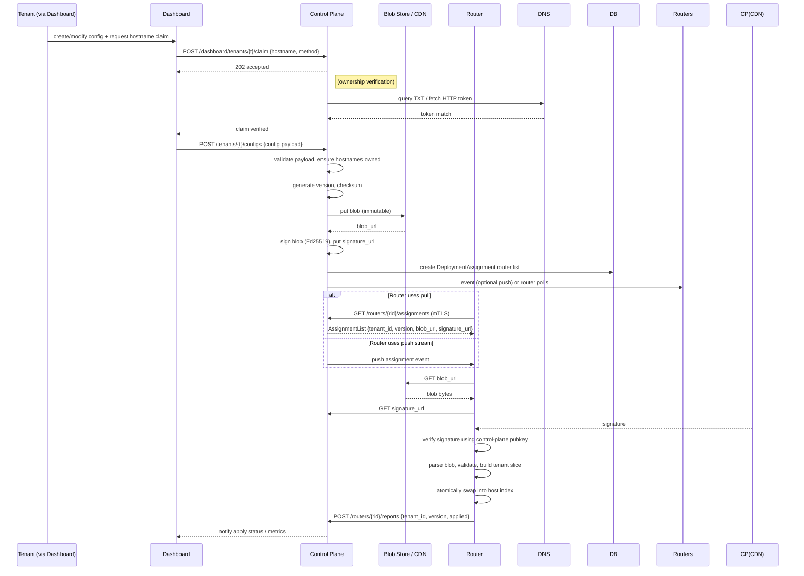

# Control Plane ↔ Router API

This document contains a compact OpenAPI-style API sketch and a sequence diagram (Mermaid) describing the dashboard → control plane → router interactions, ownership verification, signing, and assignment flows. It is intentionally minimal and focused on the operational contract.

## Goals
- Ensure tenants can only submit config via the dashboard (no direct router uploads).
- Describe how ownership (hostname claim) is verified.
- Describe how the control plane signs immutable bundles and advertises them to routers.
- Describe router pull/poll and report endpoints and required verification.

## OpenAPI (compact YAML snippet)

openapi: 3.0.1
info:
  title: CloudinatorMC Control Plane API (compact)
  version: 1.0.0
servers:
  - url: https://controlplane.example.internal
security:
  - dashboardAuth: []
paths:
  /dashboard/tenants:
    post:
      summary: Create tenant (dashboard only)
      security:
        - dashboardAuth: []
      requestBody:
        required: true
        content:
          application/json:
            schema:
              $ref: '#/components/schemas/NewTenant'
      responses:
        '201':
          description: tenant created

  /dashboard/tenants/{tenant_id}/claim:
    post:
      summary: Start hostname ownership verification for a tenant
      parameters:
        - name: tenant_id
          in: path
          required: true
          schema:
            type: string
      security:
        - dashboardAuth: []
      requestBody:
        required: true
        content:
          application/json:
            schema:
              $ref: '#/components/schemas/ClaimRequest'
      responses:
        '202':
          description: verification started

  /dashboard/tenants/{tenant_id}/configs:
    post:
      summary: Submit a new tenant config (dashboard → control plane)
      security:
        - dashboardAuth: []
      parameters:
        - name: tenant_id
          in: path
          required: true
          schema:
            type: string
      requestBody:
        required: true
        content:
          application/json:
            schema:
              $ref: '#/components/schemas/ConfigPayload'
      responses:
        '201':
          description: config accepted and signed
          content:
            application/json:
              schema:
                type: object
                properties:
                  version:
                    type: integer
                  checksum:
                    type: string
                  blob_url:
                    type: string
                  signature_url:
                    type: string

  /routers/{router_id}/assignments:
    get:
      summary: Router pulls assignment manifest (mTLS client auth)
      parameters:
        - name: router_id
          in: path
          required: true
          schema:
            type: string
        - name: since
          in: query
          description: return only changes since this monotonic index
          schema:
            type: integer
      responses:
        '200':
          description: current assignments
          content:
            application/json:
              schema:
                $ref: '#/components/schemas/AssignmentList'

  /routers/{router_id}/reports:
    post:
      summary: Router reports apply results
      parameters:
        - name: router_id
          in: path
          required: true
          schema:
            type: string
      requestBody:
        required: true
        content:
          application/json:
            schema:
              $ref: '#/components/schemas/RouterReport'
      responses:
        '202':
          description: accepted

components:
  securitySchemes:
    dashboardAuth:
      type: http
      scheme: bearer
      bearerFormat: JWT
    # Note: routers authenticate with mTLS (operation environment), not by bearer tokens.

  schemas:
    NewTenant:
      type: object
      required: [name]
      properties:
        name:
          type: string
        contact_email:
          type: string
    ClaimRequest:
      type: object
      required: [hostname, method]
      properties:
        hostname:
          type: string
        method:
          type: string
          enum: [dns-txt, http-token]
    ConfigPayload:
      type: object
      required: [routes]
      properties:
        routes:
          type: array
          items:
            $ref: '#/components/schemas/RouteEntry'
        default_backend:
          $ref: '#/components/schemas/Backend'
        metadata:
          type: object
          description: free-form metadata
    RouteEntry:
      type: object
      required: [pattern, match, backend]
      properties:
        pattern:
          type: string
        match:
          type: string
          enum: [exact, prefix, wildcard]
        backend:
          $ref: '#/components/schemas/Backend'
    Backend:
      type: object
      required: [address]
      properties:
        address:
          type: string
        use_haproxy:
          type: boolean
    AssignmentList:
      type: object
      properties:
        assignments:
          type: array
          items:
            $ref: '#/components/schemas/Assignment'
    Assignment:
      type: object
      required: [tenant_id, version, blob_url, signature_url]
      properties:
        tenant_id:
          type: string
        version:
          type: integer
        checksum:
          type: string
        blob_url:
          type: string
        signature_url:
          type: string
        effective_at:
          type: string
          format: date-time
    RouterReport:
      type: object
      required: [tenant_id, version, status]
      properties:
        tenant_id:
          type: string
        version:
          type: integer
        status:
          type: string
          enum: [applied, failed]
        message:
          type: string
        applied_at:
          type: string
          format: date-time

---

## Security and operational notes
- Tenants may only submit config via the Dashboard (dashboard calls the control plane internal API). The control plane rejects any hostname claim that fails verification.
- Control plane signs every immutable bundle (Ed25519). Routers must verify signatures with the control plane public key; routers must not accept unsigned blobs.
- Routers authenticate to the control plane using mTLS client certs; the control plane verifies router identity and then returns only assignments the router should host.
- The control plane stores hostname -> tenant ownership and refuses to sign any bundle that contains hostnames not owned by the submitting tenant.

---

## Sequence diagram (Mermaid)

